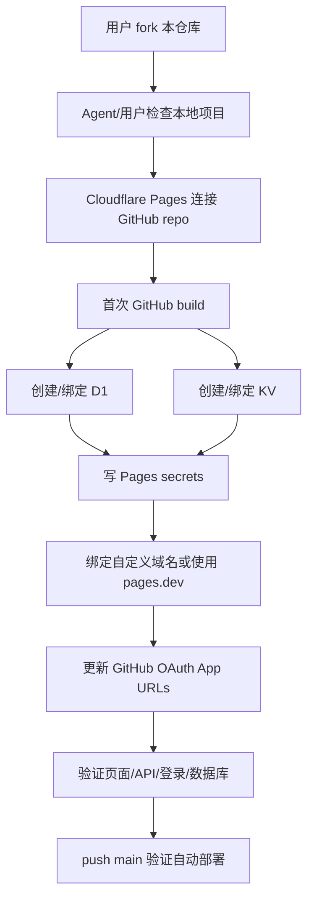

# GitStars Next Cloudflare 部署手册（GitHub 自动部署）

本手册给 AI agent / 运维执行者使用。目标：把用户 fork 后的 GitStars Next 仓库部署到 **Cloudflare Pages + Pages Functions + D1 + KV**，并启用 **GitHub push 自动部署**。

> 唯一推荐部署方式：Cloudflare Pages 关联 GitHub 仓库。不要用 Direct Upload 作为生产部署方式。

---

## 0. 成功标准

部署完成后必须满足：

```text
Cloudflare Pages project: Git Provider = Yes
Production branch: main
Build command: pnpm build
Output directory: dist
D1 binding: DB
KV binding: CACHE
Secrets: GITHUB_CLIENT_ID / GITHUB_CLIENT_SECRET / ENCRYPTION_SECRET / APP_ORIGIN
Custom domain: 可选，推荐 https://gitstars.<your-domain>
GitHub push main 后 Cloudflare 自动部署
```

验证证据：

```bash
pnpm wrangler pages project list
curl -I <APP_ORIGIN>
curl -sS <APP_ORIGIN>/api/current-user
pnpm wrangler d1 execute gitstars --remote --command "SELECT COUNT(*) FROM repositories;"
```

---

## 1. 总体流程图



---

## 2. 用户需要准备

用户必须有：

```text
1. GitHub 账号
2. Cloudflare 账号
3. 已 fork 的 GitStars Next 仓库
4. GitHub OAuth App Client ID
5. GitHub OAuth App Client Secret
```

推荐 fork 后仓库名：

```text
gitstars-next
```

GitHub OAuth App 初始 URL 可以先临时填：

```text
Homepage URL: https://gitstars-next.pages.dev
Authorization callback URL: https://gitstars-next.pages.dev/api/auth/github/callback
```

最终部署完成后，必须改成真实 `APP_ORIGIN`。

---

## 3. 给 AI agent 的最短指令

用户可以直接说：

```text
请读取 DEPLOYMENT.md，按 GitHub 关联自动部署方式，把我 fork 后的仓库部署到 Cloudflare Pages。secret 由我在终端手动输入。
```

Agent 默认行为：

```text
- 不要求用户在聊天里发送 secret
- 不复述 secret 明文
- 不把 secret 写进仓库文件
- 用 Cloudflare Pages GitHub 集成创建项目
- 到 secrets 步骤时暂停，让用户在终端交互输入
- 最终报告只写 secret 名称，不写值
```

---

## 4. 本地预检

在项目根目录执行：

```bash
pnpm install
pnpm typecheck
pnpm test
pnpm build
```

通过标准：

```text
typecheck 成功
test 成功
build 生成 dist/
```

确认没有提交 secret：

```bash
git status --short
git check-ignore .dev.vars .env .env.local
```

`.dev.vars`、`.env*` 不得提交。

---

## 5. Cloudflare 登录

```bash
pnpm wrangler whoami
```

如果未登录：

```bash
pnpm wrangler login
```

---

## 6. 创建 Cloudflare Pages GitHub 项目

进入 Cloudflare Dashboard：

```text
Workers & Pages -> Create -> Pages -> Connect to Git
```

选择用户 fork 后的仓库，例如：

```text
<github-user>/gitstars-next
```

构建配置：

```text
Project name: gitstars-next
Production branch: main
Framework preset: None
Build command: pnpm build
Build output directory: dist
Root directory: 留空
```

创建完成后，检查：

```bash
pnpm wrangler pages project list
```

必须看到：

```text
Project Name: gitstars-next
Git Provider: Yes
```

如果项目名被占用：

```text
说明已有同名 Pages 项目。
如果旧项目是 Direct Upload，不能原地改成 GitHub 项目。
可先删除旧 Pages 项目，再重新创建 GitHub 关联项目。
删除前注意：先移除旧项目 custom domain；D1/KV 不会随 Pages 项目删除。
```

---

## 7. D1 数据库

默认数据库：

```text
Database name: gitstars
Binding name: DB
```

查看：

```bash
pnpm wrangler d1 list
```

没有则创建：

```bash
pnpm wrangler d1 create gitstars
```

把返回的 `database_id` 写入 `wrangler.toml`：

```toml
[[d1_databases]]
binding = "DB"
database_name = "gitstars"
database_id = "<D1_DATABASE_ID>"
migrations_dir = "migrations"
```

应用 migrations：

```bash
pnpm wrangler d1 migrations apply gitstars --remote
```

验证表：

```bash
pnpm wrangler d1 execute gitstars --remote --command "SELECT name FROM sqlite_master WHERE type='table' ORDER BY name;"
```

在 Cloudflare Pages 项目里绑定 D1：

```text
Pages project -> Settings -> Bindings -> D1 database bindings
Variable name: DB
D1 database: gitstars
```

Agent 也可用 Cloudflare API 写入 binding。验证时只看 binding 名称和 ID，不打印 secret。

---

## 8. KV namespace

默认 KV：

```text
Namespace name: gitstars-cache
Binding name: CACHE
```

查看：

```bash
pnpm wrangler kv namespace list
```

没有则创建：

```bash
pnpm wrangler kv namespace create gitstars-cache
```

把返回的 `id` 写入 `wrangler.toml`：

```toml
[[kv_namespaces]]
binding = "CACHE"
id = "<KV_NAMESPACE_ID>"
```

在 Cloudflare Pages 项目里绑定 KV：

```text
Pages project -> Settings -> Bindings -> KV namespace bindings
Variable name: CACHE
KV namespace: gitstars-cache
```

---

## 9. Pages secrets

需要 4 个 production secrets：

```text
GITHUB_CLIENT_ID
GITHUB_CLIENT_SECRET
ENCRYPTION_SECRET
APP_ORIGIN
```

推荐：用户本机终端交互输入，不把值发给 Agent。

```bash
pnpm wrangler pages secret put GITHUB_CLIENT_ID --project-name gitstars-next
pnpm wrangler pages secret put GITHUB_CLIENT_SECRET --project-name gitstars-next
pnpm wrangler pages secret put ENCRYPTION_SECRET --project-name gitstars-next
pnpm wrangler pages secret put APP_ORIGIN --project-name gitstars-next
```

取值说明：

```text
GITHUB_CLIENT_ID: GitHub OAuth App Client ID
GITHUB_CLIENT_SECRET: GitHub OAuth App Client Secret
ENCRYPTION_SECRET: 长随机字符串，生产部署后保持稳定
APP_ORIGIN: 生产 origin，例如 https://gitstars.<your-domain> 或 https://gitstars-next.pages.dev
```

生成 `ENCRYPTION_SECRET`：

```bash
openssl rand -base64 32
```

检查 secret 名称，不看值：

```bash
pnpm wrangler pages secret list --project-name gitstars-next
```

---

## 10. 自定义域名

推荐使用子域名：

```text
https://gitstars.<your-domain>
```

不要用子路径：

```text
错误：https://<your-domain>/gitstars-next
正确：https://gitstars.<your-domain>
```

Cloudflare Dashboard：

```text
Pages project -> Custom domains -> Set up a custom domain
```

添加：

```text
gitstars.<your-domain>
```

如果要求 DNS：

```text
Type: CNAME
Name: gitstars
Target: gitstars-next.pages.dev
Proxy status: DNS only 或按 Cloudflare Pages 指引
TTL: Auto
```

等状态变为：

```text
active
```

然后把 `APP_ORIGIN` 设置为：

```text
https://gitstars.<your-domain>
```

---

## 11. GitHub OAuth App URL

部署域名确定后，更新 GitHub OAuth App：

```text
GitHub -> Settings -> Developer settings -> OAuth Apps -> 选择 App
```

填写：

```text
Homepage URL: <APP_ORIGIN>
Authorization callback URL: <APP_ORIGIN>/api/auth/github/callback
```

例：

```text
Homepage URL: https://gitstars.xxx78cc.com
Authorization callback URL: https://gitstars.xxx78cc.com/api/auth/github/callback
```

---

## 12. 自动部署验证

Cloudflare 初次创建项目时会自动从 GitHub 构建一次。

检查部署：

```bash
pnpm wrangler pages deployment list --project-name gitstars-next
```

或者 Dashboard：

```text
Pages project -> Deployments
```

必须看到最新 production deployment：

```text
queued: success
initialize: success
clone_repo: success
build: success
deploy: success
```

验证 GitHub 自动部署：

```bash
git commit --allow-empty -m "Verify Cloudflare auto deploy"
git push origin main
```

然后回 Cloudflare Deployments，看是否出现新部署。验证完成后不需要手动 `wrangler pages deploy`。

---

## 13. 线上验证

静态页：

```bash
curl -I <APP_ORIGIN>
```

当前用户接口：

```bash
curl -sS <APP_ORIGIN>/api/current-user
```

数据库：

```bash
pnpm wrangler d1 execute gitstars --remote --command "SELECT COUNT(*) AS repositories FROM repositories;"
```

浏览器验证：

```text
1. 打开 <APP_ORIGIN>
2. 点击 GitHub 登录
3. 登录成功后同步 starred repositories
4. 检查 Star Library 有数据
5. 测试 AI 摘要
6. 测试 AI 分组
```

---

## 14. 常见问题

### 14.1 Git Provider 显示 No

说明项目不是 GitHub 关联项目，通常是 Direct Upload 项目。

处理：

```text
新建 Cloudflare Pages 项目时必须选择 Connect to Git。
旧 Direct Upload 项目不能原地改成 GitHub 项目。
```

### 14.2 项目名已存在

如果旧项目不用了：

```text
1. 移除旧项目 custom domain
2. 删除旧 Pages project
3. 重新用 GitHub 仓库创建同名 Pages project
4. 重新绑定 D1/KV/secrets/custom domain
```

D1/KV 不会因为删除 Pages project 自动删除。

### 14.3 页面能打开但登录失败

检查：

```text
GITHUB_CLIENT_ID 是否设置
GITHUB_CLIENT_SECRET 是否设置
APP_ORIGIN 是否和访问域名一致
GitHub OAuth App callback 是否为 <APP_ORIGIN>/api/auth/github/callback
```

### 14.4 页面没数据

检查：

```text
D1 binding 名称必须是 DB
migrations 是否已执行
用户是否已登录 GitHub
是否已点击同步
```

### 14.5 APP_ORIGIN 改了是否要重新部署

Pages Functions 读取 Pages secret。更新 secret 后建议触发一次新 GitHub 部署：

```bash
git commit --allow-empty -m "Refresh Cloudflare Pages secrets"
git push origin main
```

---

## 15. 最终交付报告模板

Agent 完成后输出：

```text
Cloudflare Pages: gitstars-next
Git Provider: Yes
Repository: <github-user>/gitstars-next
Production branch: main
Build command: pnpm build
Output directory: dist
D1 binding DB: set
KV binding CACHE: set
Secrets: set, values not printed
APP_ORIGIN: <APP_ORIGIN>
GitHub OAuth callback: <APP_ORIGIN>/api/auth/github/callback
Latest deployment: success
Auto deploy: enabled
```
