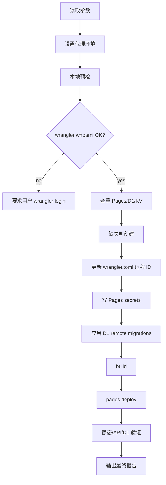
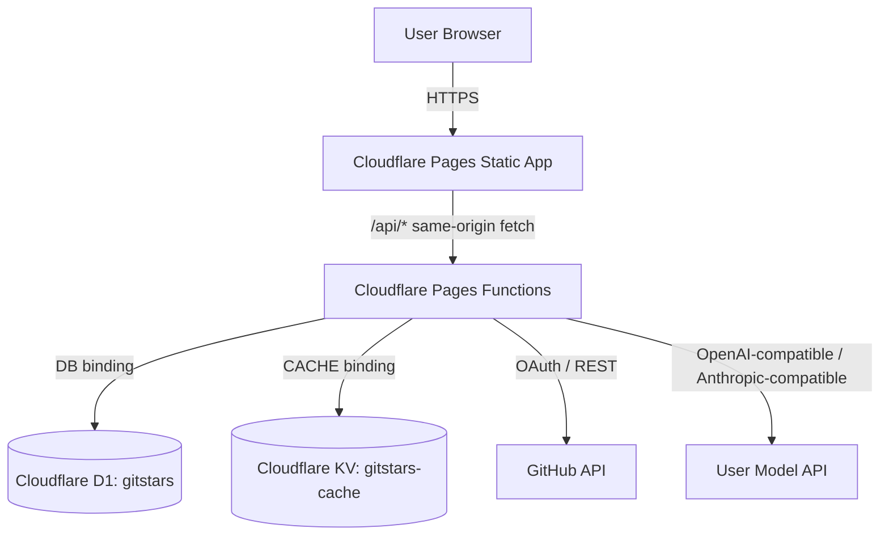
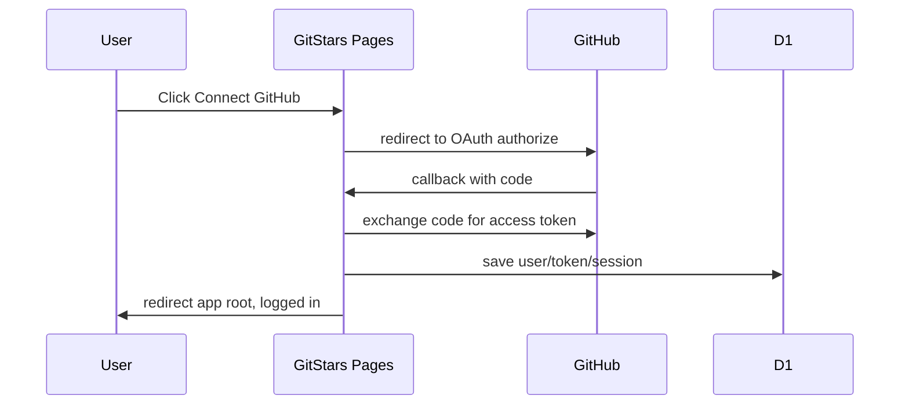

# GitStars Next Cloudflare 部署手册（Agent Runbook）

本手册给 AI agent / 运维执行者使用，目标是把 GitStars Next 部署到 **Cloudflare Pages + Pages Functions + D1 + KV**。

> 原则：步骤要可复现、输出可验证、secret 不落库、不打印、不提交。


---

## A. 一次性全自动部署模式（给 Agent 用）

本节是最高优先级执行入口。用户希望“给必要参数，Agent 其余全部自动处理”时，Agent 按本节执行，再引用后续章节做细节校验。

### A.1 自动化边界

Agent 可以自动完成：

```text
- 本地预检：install/typecheck/test/build
- Cloudflare 登录状态检查
- Cloudflare Pages/D1/KV 查重
- 缺失资源创建
- wrangler.toml 写入远程 D1/KV ID
- Pages secrets 写入
- D1 remote migrations
- Pages production deploy
- curl/API/D1 基础验证
- 最终报告
```

可能需要用户介入的步骤：

```text
- Cloudflare 未登录：用户需完成 wrangler login 浏览器授权
- GitHub OAuth App 不存在：用户需先创建一个 App，并给出 GITHUB_CLIENT_ID / GITHUB_CLIENT_SECRET；初始 Homepage/Callback 可先临时填写，部署后 Agent 会给出最终 URL
- 自定义域名：用户无需提前提供；Agent 优先读取 Cloudflare Pages 已配置 custom domain，否则使用 pages.dev 默认域名
- OAuth 登录、同步、模型、分组等浏览器级验证：Agent 可指导；若有浏览器自动化权限，也可执行
```

默认策略：

```text
如果用户提供 GITHUB_CLIENT_ID / GITHUB_CLIENT_SECRET，Agent 不创建 GitHub OAuth App。
如果用户未提供，Agent 停止在 OAuth 参数缺失处，给出最短人工动作。
```

### A.2 用户需要准备什么

默认安全模式：用户 **不在聊天中发送任何 secret**。用户只需要提前创建一个 GitHub OAuth App，并准备：

```text
GITHUB_CLIENT_ID
GITHUB_CLIENT_SECRET
```

到 Pages secrets 阶段时，Agent 暂停并给出 `wrangler pages secret put ...` 命令；用户在自己的终端 prompt 中手动输入。这样 secret 不进入聊天记录。

Agent 默认值：

```text
CLOUDFLARE_PROJECT_NAME=gitstars-next
D1_DATABASE_NAME=gitstars
KV_NAMESPACE_NAME=gitstars-cache
PRODUCTION_BRANCH=main
PRODUCTION_ORIGIN=部署后由 Agent 从 Cloudflare Pages 域名推导
ENCRYPTION_SECRET=Agent 生成或提示用户本地生成
```

域名规则：用户不需要提前提供域名。Agent 优先使用 Cloudflare Pages 已绑定且 active 的 custom domain；否则使用默认 `https://gitstars-next.pages.dev`。

若用户明确要求全自动并愿意承担风险，也可以把 `GITHUB_CLIENT_ID` / `GITHUB_CLIENT_SECRET` 交给 Agent 写入 Cloudflare secrets；最终报告仍不得打印 secret 值。

### A.3 推荐交付参数格式

用户可直接发给 Agent：

```text
请按 docs/cloudflare-agent-deploy.md 全自动部署。
secret 由我在终端手动输入。
ENCRYPTION_SECRET=请 Agent 生成或提示我本地生成。
```

Agent 收到后：

```text
- 不要求用户在聊天里发送 secret
- 不复述 secret 明文
- 不把 secret 写进仓库文件
- 到 Cloudflare Pages secrets 阶段时暂停，给用户 Wrangler prompt 命令
- 用户在自己的终端手动输入 secret 后，Agent 继续后续部署
- 最终报告只写 “Secrets: set, values not printed”
```


### A.3.1 OAuth URL 自动推导规则

用户不在聊天中提供 `GITHUB_CLIENT_ID` / `GITHUB_CLIENT_SECRET` 时，Agent 不要求用户提前提供域名。

Agent 部署后按优先级确定 `PRODUCTION_ORIGIN`：

```text
1. 如果 Cloudflare Pages 项目已有 custom domain，优先使用最适合当前项目的 custom domain
   例：gitstars.xxx78cc.com -> https://gitstars.xxx78cc.com
2. 如果没有 custom domain，使用默认 Pages 域名
   例：https://gitstars-next.pages.dev
3. 不使用子路径域名
   错误：https://xxx78cc.com/gitstars-next
```

Agent 必须生成并提示用户更新 GitHub OAuth App：

```text
Homepage URL:
<PRODUCTION_ORIGIN>

Authorization callback URL:
<PRODUCTION_ORIGIN>/api/auth/github/callback
```

如果用户的 GitHub OAuth App 当前先随便填了默认 URL，也可以。部署完成后以 Agent 输出的这两个 URL 为准，用户回 GitHub OAuth App 修改。

GitHub 更新路径：

```text
GitHub -> Settings -> Developer settings -> OAuth Apps -> 选择该 App
```

Agent 在用户确认已更新 GitHub OAuth URL 后，再执行 OAuth 登录验证。未确认前，OAuth 验证状态报告为：

```text
OAuth: not run, waiting for GitHub OAuth URL update
```


### A.3.2 Custom domain 自动配置规则

如果用户希望使用自己的 Cloudflare zone（例如 `xxx78cc.com`），Agent 推荐绑定子域名：

```text
gitstars.<zone>
```

不要绑定子路径：

```text
错误：https://<zone>/gitstars-next
正确：https://gitstars.<zone>
```

Agent 可通过 Cloudflare Pages Domains API 添加 custom domain。添加后若 Pages 显示：

```text
CNAME record not set
```

则需要在对应 zone 添加 DNS 记录：

```text
Type: CNAME
Name: gitstars
Target: gitstars-next.pages.dev
Proxy status: DNS only（灰云，至少验证阶段使用）
TTL: Auto
```

等 Pages domain 状态变为 `active` 后，Agent 必须把 `APP_ORIGIN` 更新为 custom domain，并重新部署 Pages Functions：

```bash
printf '%s' "https://gitstars.<zone>" | pnpm wrangler pages secret put APP_ORIGIN --project-name gitstars-next
pnpm build
pnpm wrangler pages deploy dist --project-name gitstars-next --branch main
```

随后提示用户把 GitHub OAuth App 更新为：

```text
Homepage URL: https://gitstars.<zone>
Authorization callback URL: https://gitstars.<zone>/api/auth/github/callback
```

### A.4 全自动执行算法

Agent 必须按顺序执行：



### A.5 Agent 可直接运行的命令骨架

> 注意：secret 值不要出现在命令回显里。下面 `<...>` 是占位。

```bash
# 1. proxy, if needed
export http_proxy=http://127.0.0.1:7897
export https_proxy=http://127.0.0.1:7897
export HTTP_PROXY=http://127.0.0.1:7897
export HTTPS_PROXY=http://127.0.0.1:7897
export no_proxy=localhost,127.0.0.1,.local,.amh-group.com
export NO_PROXY=localhost,127.0.0.1,.local,.amh-group.com

# 2. preflight
pnpm install
pnpm typecheck
pnpm test
pnpm build

# 3. auth/resource discovery
pnpm wrangler whoami
pnpm wrangler pages project list
pnpm wrangler d1 list
pnpm wrangler kv namespace list

# 4. create missing resources
pnpm wrangler pages project create gitstars-next --production-branch main --compatibility-date 2026-05-28
pnpm wrangler d1 create gitstars --binding DB
pnpm wrangler kv namespace create gitstars-cache --binding CACHE

# 5. after wrangler.toml has remote IDs
pnpm wrangler d1 migrations apply gitstars --remote
pnpm wrangler pages deploy dist --project-name gitstars-next --branch main

# 6. verification; replace $PRODUCTION_ORIGIN with the final pages.dev or custom domain
PRODUCTION_ORIGIN=https://gitstars-next.pages.dev
curl -I "$PRODUCTION_ORIGIN"
curl -sS "$PRODUCTION_ORIGIN/api/me"
pnpm wrangler d1 execute gitstars --remote --command "SELECT name FROM sqlite_master WHERE type='table' ORDER BY name;"
```

### A.6 Pages secrets 手动写入方式

默认使用 Wrangler secret prompt。Agent 不接收 secret 明文，用户在自己的终端执行并手动输入：

```bash
pnpm wrangler pages secret put GITHUB_CLIENT_ID --project-name gitstars-next
pnpm wrangler pages secret put GITHUB_CLIENT_SECRET --project-name gitstars-next
pnpm wrangler pages secret put ENCRYPTION_SECRET --project-name gitstars-next
pnpm wrangler pages secret put APP_ORIGIN --project-name gitstars-next
```

输入规则：

```text
GITHUB_CLIENT_ID：GitHub OAuth App Client ID
GITHUB_CLIENT_SECRET：GitHub OAuth App 新生成的 Client Secret
ENCRYPTION_SECRET：长随机字符串；首次生产部署后保持稳定
APP_ORIGIN：Agent 推导出的生产 origin；无 custom domain 时为 https://gitstars-next.pages.dev
```

生成 ENCRYPTION_SECRET：

```bash
node -e "console.log(crypto.randomUUID() + crypto.randomUUID())"
```

执行后验证 secret 名称，不看值：

```bash
pnpm wrangler pages secret list --project-name gitstars-next
```

### A.7 自动停止条件

遇到以下情况必须停止并报告：

```text
- pnpm typecheck/test/build 任一失败
- wrangler 未登录且无法非交互继续
- 用户尚未在 Wrangler prompt 中写入 GITHUB_CLIENT_ID / GITHUB_CLIENT_SECRET
- Cloudflare 创建资源失败
- wrangler.toml 无法安全写入远程 ID
- D1 migrations 失败
- Pages deploy 失败
- /api/me 不是 ok:true
- OAuth 验证前，用户未按 Agent 输出更新 GitHub OAuth Homepage/Callback URL
```

### A.8 全自动最终报告

```text
Deployment complete.
URL: https://...
Pages project: gitstars-next
D1: gitstars / <id prefix only>
KV: CACHE / <id prefix only>
Migrations: applied
Validation:
  - install: passed
  - typecheck: passed
  - test: passed
  - build: passed
  - deploy: passed
  - /api/me: passed
  - D1 tables: passed
  - OAuth: not run unless browser validation completed
  - sync/model/group: not run unless browser validation completed
Secrets: set, values not printed
Changed files:
  - docs/cloudflare-agent-deploy.md, if this edit is part of the task
  - wrangler.toml, remote D1/KV IDs only if deployment executed
```
---

## 0. 部署总览

### 0.1 架构图



### 0.2 部署流程图


### 0.3 项目信息

```text
App name: gitstars-next
Cloudflare product: Pages + Pages Functions
Frontend build output: dist
Functions path: functions/api/**
D1 binding: DB
D1 database name: gitstars
KV binding: CACHE
KV namespace name: gitstars-cache
Production default domain: https://gitstars-next.pages.dev
```

### 0.4 必需环境变量

```text
APP_ORIGIN              # 生产 origin，无尾部斜杠，例如 https://gitstars-next.pages.dev
GITHUB_CLIENT_ID        # GitHub OAuth App Client ID
GITHUB_CLIENT_SECRET    # GitHub OAuth App Client Secret
ENCRYPTION_SECRET       # 长随机字符串；首次部署后必须保持稳定
```

本地专用，不要配到生产：

```text
DEV_GITHUB_TOKEN
```

---

## 1. Agent 执行规则

- 不提交真实 secret。
- 不在日志、最终回复、截图里暴露 secret 值。
- 每次 Cloudflare 资源变更后必须做验证。
- 已存在资源优先复用，不重复创建。
- `wrangler.toml` 里的 `local-*` 占位 ID 只能用于本地；生产部署前必须替换成远程 D1/KV ID。
- 破坏性远程命令禁止执行，除非用户明确要求并确认备份。
- 外网 shell 命令如需代理，先设置代理变量。

代理片段：

```bash
export http_proxy=http://127.0.0.1:7897
export https_proxy=http://127.0.0.1:7897
export HTTP_PROXY=http://127.0.0.1:7897
export HTTPS_PROXY=http://127.0.0.1:7897
export no_proxy=localhost,127.0.0.1,.local,.amh-group.com
export NO_PROXY=localhost,127.0.0.1,.local,.amh-group.com
```

---

## 2. 本地预检

从仓库根目录执行：

```bash
pwd
pnpm install
pnpm typecheck
pnpm test
pnpm build
```

通过标准：

```text
- 当前目录是 gitstars-next
- 依赖安装成功
- typecheck/test/build 全部通过
- dist/ 生成成功
```

失败处理：停止部署，修代码或报告 blocker。

---

## 3. Cloudflare 登录检查

```bash
pnpm wrangler whoami
```

如果未登录：

```bash
pnpm wrangler login
```

说明：不要自动化交互式浏览器登录，除非用户明确允许。

留证点：记录账户邮箱 / account id 前缀即可，不输出敏感 token。

---

## 4. 查找或创建 Cloudflare 资源

### 4.1 查找现有资源

先查重：

```bash
pnpm wrangler pages project list
pnpm wrangler d1 list
pnpm wrangler kv namespace list
```

判断规则：

```text
Pages project: gitstars-next 存在则复用
D1 database: gitstars 存在则复用
KV namespace: gitstars-cache 存在则复用
```

### 4.2 Pages project

不存在才创建：

```bash
pnpm wrangler pages project create gitstars-next --production-branch main --compatibility-date 2026-05-28
```

验证：

```bash
pnpm wrangler pages project list | grep gitstars-next
```

### 4.3 D1 database

不存在才创建：

```bash
pnpm wrangler d1 create gitstars --binding DB
```

从输出中记录：

```text
database_name = gitstars
database_id = <REMOTE_D1_DATABASE_ID>
```

验证：

```bash
pnpm wrangler d1 list | grep gitstars
```

### 4.4 KV namespace

不存在才创建：

```bash
pnpm wrangler kv namespace create gitstars-cache --binding CACHE
```

从输出中记录：

```text
binding = CACHE
id = <REMOTE_KV_NAMESPACE_ID>
```

验证：

```bash
pnpm wrangler kv namespace list | grep gitstars-cache
```

---

## 5. 更新 `wrangler.toml`

生产部署前，把本地占位替换成远程 ID：

```toml
name = "gitstars-next"
compatibility_date = "2026-05-28"
pages_build_output_dir = "dist"

[[d1_databases]]
binding = "DB"
database_name = "gitstars"
database_id = "<REMOTE_D1_DATABASE_ID>"
migrations_dir = "migrations"

[[kv_namespaces]]
binding = "CACHE"
id = "<REMOTE_KV_NAMESPACE_ID>"
```

验证不能再出现：

```text
local-gitstars
local-gitstars-cache
```

命令：

```bash
grep -n "database_id\|local-gitstars\|local-gitstars-cache\|kv_namespaces\|binding = \"CACHE\"\|id =" wrangler.toml
```

通过标准：

```text
- database_id 是 Cloudflare D1 UUID
- KV id 是 Cloudflare KV namespace id
- 文件里没有 local-* 占位
```

---

## 6. GitHub OAuth 配置

### 6.1 创建 OAuth App

GitHub 页面路径：

```text
GitHub -> Settings -> Developer settings -> OAuth Apps -> New OAuth App
```

### 6.2 填写生产 URL

默认 Cloudflare Pages 域名：

```text
Homepage URL:
https://gitstars-next.pages.dev

Authorization callback URL:
https://gitstars-next.pages.dev/api/auth/github/callback
```

如果使用自定义域名，替换成自定义域名，例如：

```text
Homepage URL:
https://stars.example.com

Authorization callback URL:
https://stars.example.com/api/auth/github/callback
```

规则：

```text
APP_ORIGIN 必须等于 Homepage URL
APP_ORIGIN 不能有尾部斜杠
callback URL 必须精确到 /api/auth/github/callback
```

留证点：截图 OAuth App 配置页，但遮挡 Client Secret。

---

## 7. 配置 Cloudflare Pages 环境变量 / Secrets

### 7.1 Wrangler 方式

逐个输入，不要把值写进命令行历史：

```bash
pnpm wrangler pages secret put GITHUB_CLIENT_ID --project-name gitstars-next
pnpm wrangler pages secret put GITHUB_CLIENT_SECRET --project-name gitstars-next
pnpm wrangler pages secret put ENCRYPTION_SECRET --project-name gitstars-next
pnpm wrangler pages secret put APP_ORIGIN --project-name gitstars-next
```

`APP_ORIGIN` 示例：

```text
https://gitstars-next.pages.dev
```

`ENCRYPTION_SECRET` 生成示例：

```bash
node -e "console.log(crypto.randomUUID() + crypto.randomUUID())"
```

注意：`ENCRYPTION_SECRET` 首次生产上线后不要更换，否则已加密 GitHub token / model token 无法解密。

### 7.2 Dashboard 方式

Cloudflare 控制台路径：

```text
Cloudflare Dashboard
-> Workers & Pages
-> gitstars-next
-> Settings
-> Environment variables
```

添加：

```text
GITHUB_CLIENT_ID
GITHUB_CLIENT_SECRET
ENCRYPTION_SECRET
APP_ORIGIN
```

环境选择：

```text
Production: 必填
Preview: 如果需要预览部署，也填同一组或预览专用值
```

留证点：截图变量名列表即可，必须遮挡变量值。

---

## 8. 应用远程 D1 migrations

确认 `wrangler.toml` 已指向远程 D1 后执行：

```bash
pnpm wrangler d1 migrations apply gitstars --remote
```

Wrangler 可能要求确认，确认迁移文件来自本仓库后继续。

验证表结构：

```bash
pnpm wrangler d1 execute gitstars --remote --command "SELECT name FROM sqlite_master WHERE type='table' ORDER BY name;"
```

预期核心表：

```text
users
github_tokens
sessions
repositories
user_repositories
groups
repository_groups
summaries
model_settings
sync_jobs
summary_jobs
summary_job_items
github_sync_state
```

验证计数：

```bash
pnpm wrangler d1 execute gitstars --remote --command "SELECT (SELECT COUNT(*) FROM repositories) AS repositories_count, (SELECT COUNT(*) FROM groups) AS groups_count, (SELECT COUNT(*) FROM summaries) AS summaries_count;"
```

新库初始通常为：

```text
repositories_count = 0
groups_count = 0
summaries_count = 0
```

---

## 9. Build 和部署 Pages

重新 build：

```bash
pnpm build
```

部署 production branch：

```bash
pnpm wrangler pages deploy dist --project-name gitstars-next --branch main
```

记录 Wrangler 输出里的部署 URL：

```text
https://<deployment-id>.gitstars-next.pages.dev
https://gitstars-next.pages.dev
```

如果前面刚设置或修改了环境变量，建议重新部署一次，确保 Functions 使用最新配置。

---

## 10. 生产验证

### 10.1 静态页

```bash
curl -I https://gitstars-next.pages.dev
```

预期：

```text
HTTP 200 或 304
content-type 包含 text/html
```

### 10.2 API 未登录形态

```bash
curl -sS https://gitstars-next.pages.dev/api/me
```

预期 JSON 形态：

```json
{
  "ok": true,
  "data": {
    "user": null,
    "settings": {
      "model_enabled": false
    },
    "csrf_token": null
  }
}
```

字段可更多，但必须：

```text
ok = true
user = null
```

### 10.3 OAuth 登录

浏览器打开：

```text
https://gitstars-next.pages.dev
```

点击：

```text
Connect GitHub
```

预期流程：



通过标准：

```text
- 回到首页
- 顶部显示 GitHub connected / 用户信息
- /api/me 返回 user 非 null
```

### 10.4 同步验证

登录后执行：

```text
1. 点击 Sync GitHub
2. 等同步进度完成
3. 页面出现 Star 仓库卡片
```

远程 D1 验证：

```bash
pnpm wrangler d1 execute gitstars --remote --command "SELECT COUNT(*) AS repositories_count FROM repositories;"
```

通过标准：

```text
repositories_count > 0
页面仓库数量 > 0
```

### 10.5 模型验证

页面路径：

```text
Avatar / User settings -> Model Settings
```

填写：

```text
Base URL
Model name
API Key
```

执行：

```text
Test -> Save
```

通过标准：

```text
- Test 成功
- Save 成功
- API Key 不在前端回显明文
```

### 10.6 摘要验证

任选一种：

```text
- Missing Summary -> 右键 -> One-click summary
- 仓库详情 -> summary editor -> regenerate summary
```

通过标准：

```text
- summary job 有进度
- 卡片显示中文摘要
- summaries 表计数增加
```

远程 D1 验证：

```bash
pnpm wrangler d1 execute gitstars --remote --command "SELECT COUNT(*) AS summaries_count FROM summaries;"
```

### 10.7 分组验证

页面操作：

```text
1. 打开 Group Settings
2. Generate suggestions
3. 选择候选分组
4. Save / Accept groups
5. 打开 Ungrouped view
6. 右键 -> One-click grouping
```

通过标准：

```text
- 候选分组是中文最终结果，不是 critique 文本
- groups 表出现分组
- repository_groups 表出现关联
- 未分组数量下降
```

远程 D1 验证：

```bash
pnpm wrangler d1 execute gitstars --remote --command "SELECT (SELECT COUNT(*) FROM groups) AS groups_count, (SELECT COUNT(*) FROM repository_groups) AS repository_groups_count;"
```

---

## 11. 图文留证清单

部署报告建议包含这些截图/输出块：

| 阶段 | 留证内容 | 注意 |
|---|---|---|
| Wrangler 登录 | `pnpm wrangler whoami` 输出 | 只保留账号标识，不放 token |
| Pages project | Cloudflare Pages 项目页 | 项目名 `gitstars-next` 清晰可见 |
| D1 | D1 数据库详情页 | 只显示 ID 前缀 |
| KV | KV namespace 详情页 | 只显示 ID 前缀 |
| Env vars | Pages Environment variables | 遮挡所有值 |
| GitHub OAuth | OAuth App 配置页 | 遮挡 Client Secret |
| Build | `pnpm build` 成功输出 | 保留 dist 文件摘要 |
| Deploy | Pages deploy 成功 URL | 保留生产 URL |
| API | `/api/me` JSON | 未登录 ok:true |
| Login | 登录后首页 | 遮挡头像/隐私信息按需 |
| Sync | 仓库卡片出现 | 不截敏感 token |
| D1 count | 表计数 SQL 输出 | 证明数据入库 |

---

## 11.1 本地 D1 数据迁移到远端（可选）

生产登录成功后，远端 D1 默认不会自动拥有本地开发数据。可选两种方式：

```text
A. 推荐干净路径：在生产页面点击 Sync GitHub，重新从 GitHub 拉取 Star。
B. 保留本地摘要/分组：导入本地业务数据到远端 D1。
```

导入业务数据时，默认不要导入本地 `sessions` / `github_tokens` / `users`，避免覆盖生产登录态和 token。通常只迁移：

```text
repositories
user_repositories
groups
repository_groups
summaries
model_settings（可选；注意 API Key 加密依赖 ENCRYPTION_SECRET）
github_sync_state（可选）
```

执行远端导入前必须先生成本地 SQL 备份文件，并让用户确认，因为 `wrangler d1 execute --remote --file` 会修改生产数据库。

## 12. 常用运维命令

本地完整启动：

```bash
pnpm build
pnpm wrangler d1 migrations apply gitstars --local
pnpm wrangler pages dev dist --ip 127.0.0.1 --port 8788
```

远程表计数：

```bash
pnpm wrangler d1 execute gitstars --remote --command "SELECT (SELECT COUNT(*) FROM repositories) AS repositories_count, (SELECT COUNT(*) FROM groups) AS groups_count, (SELECT COUNT(*) FROM summaries) AS summaries_count;"
```

查看 Pages secret 名称：

```bash
pnpm wrangler pages secret list --project-name gitstars-next
```

重新部署：

```bash
pnpm build
pnpm wrangler pages deploy dist --project-name gitstars-next --branch main
```

本地清空分组数据，仅限本地：

```bash
pnpm wrangler d1 execute gitstars --local --command "DELETE FROM repository_groups; DELETE FROM groups;"
```

禁止未经确认执行类似远程命令：

```bash
pnpm wrangler d1 execute gitstars --remote --command "DELETE FROM ..."
```

---

## 13. 回滚

### 13.1 前端 / Functions 回滚

Cloudflare 控制台路径：

```text
Cloudflare Dashboard
-> Workers & Pages
-> gitstars-next
-> Deployments
-> 选择 previous successful deployment
-> Rollback
```

### 13.2 D1 回滚

原则：

```text
优先 forward fix。
不要执行破坏性 down migration，除非用户明确批准且已有备份/导出。
```

---

## 14. 常见故障

### 14.1 D1 binding 缺失

症状：

```text
API 返回 D1 DB is required
或页面登录后空数据异常
```

检查：

```bash
grep -n "database_id\|binding = \"DB\"" wrangler.toml
pnpm wrangler d1 list | grep gitstars
```

修复：

```text
- wrangler.toml 使用远程 D1 ID
- Pages project 已重新部署
- D1 migrations 已 apply --remote
```

### 14.2 OAuth callback mismatch

症状：

```text
GitHub OAuth error: redirect_uri mismatch
```

修复：

```text
GitHub callback URL = https://<domain>/api/auth/github/callback
APP_ORIGIN = https://<domain>
两者域名必须完全一致，APP_ORIGIN 无尾部斜杠
```

### 14.3 CSRF_INVALID

症状：

```text
POST/PUT/PATCH/DELETE 返回 CSRF_INVALID
```

修复：

```text
- 先同源调用 /api/me 建立 csrf cookie/token
- 确认浏览器没有跨域访问
- 确认 APP_ORIGIN 是当前生产域名
```

### 14.4 Model request blocked

症状：

```text
MODEL_REQUEST_BLOCKED
URL validation error
```

修复：

```text
- 使用公网 HTTPS 模型 endpoint
- 不使用 localhost / private IP / 内网地址
- 确认模型接口兼容 OpenAI 或 Anthropic 风格
```

### 14.5 数据同步慢或暂停

症状：

```text
sync job paused
rate limited
processed_count 长时间不动
```

修复：

```text
- 等 GitHub rate limit 恢复
- 重新点击 Sync GitHub
- 必要时执行 repair sync（如果 UI 提供）
```

---

## 15. Agent 最终报告模板

部署完成后只报告这些，不输出 secret：

```text
Deployment complete.
URL: https://...
Pages project: gitstars-next
D1: gitstars / <id prefix only>
KV: CACHE / <id prefix only>
Migrations: applied
Validation:
  - typecheck: passed
  - test: passed
  - build: passed
  - /api/me: passed
  - OAuth: <passed | not run + reason>
  - sync: <passed | not run + reason>
  - model: <passed | not run + reason>
  - group: <passed | not run + reason>
Secrets: set, values not printed
Changed files:
  - wrangler.toml: remote D1/KV IDs only, if changed
```
