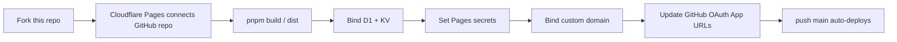

# GitStars Next

[中文文档](README.md)

GitStars Next is an AI-assisted GitHub Star management workspace. It syncs a user's real GitHub Stars into Cloudflare D1, generates Chinese summaries with the user's own model endpoint, and helps maintain repositories in a durable multi-group library.

Target runtime:

```text
Vue 3 frontend + Cloudflare Pages Functions + Cloudflare D1 + Cloudflare KV
```

---

## 1. Features

### 1.1 GitHub Star sync

- Production login through GitHub OAuth.
- Local development login through a GitHub token.
- Pull the user's real public starred repositories.
- Incremental sync with page/cursor/progress state.
- Repair sync for full reconciliation and missing Star backfill.
- Star / Unstar public GitHub repositories.
- GitHub rate-limit pause and resume states.

### 1.2 Star management workspace

- Repository cards.
- Repository detail panel.
- Views for all Stars, ungrouped repos, recently starred repos, and repos missing summaries.
- Search by repository name, owner, language, group, summary, and notes.
- Context menus and command palette.
- Light / dark theme.

### 1.3 AI Chinese summaries

- Generate short and detailed Chinese summaries for repositories missing summaries.
- Generate a summary for a single repository.
- Batch-generate missing summaries.
- User-written summaries take priority over AI summaries.
- Model settings are stored on the server; API keys are encrypted and never returned in plain text.

### 1.4 AI grouping

- Generate Chinese candidate groups from all Stars and existing summaries.
- After the user selects candidate groups, AI assigns repositories into groups.
- One-click smart grouping for the ungrouped view.
- If no group fits, ask before creating a new group.
- Create, rename, and delete groups manually.
- Repository group editing uses a draft modal; changes are saved only after Done.

### 1.5 Security

- HttpOnly session cookie.
- CSRF checks for write APIs.
- Encrypted GitHub tokens.
- Encrypted model API keys.
- SSRF guard for model endpoints; localhost, private IPs, and internal addresses are blocked.
- Model request timeout and response-size limits.

---

## 2. Architecture

### 2.1 Overview

```text
Browser
  |
  | HTTPS
  v
Cloudflare Pages static assets
  |
  | same-origin fetch /api/*
  v
Cloudflare Pages Functions
  |
  +--> D1 binding DB
  |      users / sessions / github_tokens
  |      repositories / user_repositories
  |      groups / repository_groups
  |      summaries / sync_jobs / summary_jobs
  |
  +--> KV binding CACHE
  |
  +--> GitHub API
  |      OAuth / user / starred repos / star / unstar
  |
  +--> User model API
         OpenAI-compatible or Anthropic-compatible endpoint
```

### 2.2 Key directories

```text
src/                         Vue frontend, Pinia store, UI, API client
functions/api/               Cloudflare Pages Functions API
functions/api/_shared/       D1, GitHub, AI, auth, CSRF, crypto, HTTP helpers
migrations/                  D1 schema migrations
DEPLOYMENT.md                 AI-agent Cloudflare deployment runbook
scripts/                     Smoke and API validation scripts
wrangler.toml                Cloudflare Pages/D1/KV config
.dev.vars.example            Local development env template
```

### 2.3 Long-running jobs

The project does not depend on Cloudflare Queues or Durable Objects. Long operations are frontend-driven step jobs:

```text
GitHub sync:
/api/sync/start
  -> repeated /api/sync/step

Summary generation:
/api/summaries/start
  -> repeated /api/summaries/step

AI grouping:
/api/groups/suggestions
  -> /api/groups/suggestions/accept
  -> /api/groups/auto-assign
```

Benefit: MVP deploys with only Pages Functions + D1. Tradeoff: the browser must keep the job loop running; very long jobs are not true background tasks.

---

## 3. Data storage

### 3.1 D1

Core tables:

```text
users                 GitHub users
sessions              Login sessions and CSRF token hashes
github_tokens          Encrypted GitHub OAuth tokens
repositories           GitHub repository metadata
user_repositories      User-Star relation rows
groups                 User groups
repository_groups      Repository-group relations
summaries              User summaries, AI summaries, fallback summaries
model_settings         User model config and encrypted API key
sync_jobs              GitHub sync jobs
github_sync_state      GitHub sync progress state
summary_jobs           Summary jobs
summary_job_items      Summary job items
```

### 3.2 KV

Current binding name:

```text
CACHE
```

KV is primarily a cache / extension binding. D1 is the source of truth for core business data.

---

## 4. Local run

### 4.1 Install dependencies

```bash
pnpm install
```

### 4.2 Configure local env

```bash
cp .dev.vars.example .dev.vars
```

Example `.dev.vars`:

```text
GITHUB_CLIENT_ID=your_github_oauth_app_client_id
GITHUB_CLIENT_SECRET=your_github_oauth_app_client_secret
ENCRYPTION_SECRET=local-long-random-secret
APP_ORIGIN=http://127.0.0.1:8788

# Optional: local token login without an OAuth App
DEV_GITHUB_TOKEN=your_github_token
```

### 4.3 Start local Cloudflare Pages service

Do not run only `pnpm dev`. `pnpm dev` starts only the Vite frontend and does not mount Pages Functions or D1 bindings, so the page will not have real API data.

Correct local startup:

```bash
pnpm build
pnpm wrangler d1 migrations apply gitstars --local
pnpm wrangler pages dev dist --ip 127.0.0.1 --port 8788
```

Open:

```text
http://127.0.0.1:8788
```

---

## 5. Local auth and testing

### 5.1 Local OAuth login

If `.dev.vars` contains GitHub OAuth config:

```text
GITHUB_CLIENT_ID
GITHUB_CLIENT_SECRET
ENCRYPTION_SECRET
APP_ORIGIN=http://127.0.0.1:8788
```

Open:

```text
http://127.0.0.1:8788/api/auth/github/start
```

The GitHub OAuth App should include:

```text
Homepage URL:
http://127.0.0.1:8788

Authorization callback URL:
http://127.0.0.1:8788/api/auth/github/callback
```

### 5.2 Local token login

If you do not want a local OAuth App, use a GitHub token:

```text
DEV_GITHUB_TOKEN=...
ENCRYPTION_SECRET=local-long-random-secret
APP_ORIGIN=http://127.0.0.1:8788
```

Login URL:

```text
http://127.0.0.1:8788/api/dev/login
```

Limits:

```text
/api/dev/login only allows localhost / 127.0.0.1 / ::1
Production cannot use DEV_GITHUB_TOKEN login
```

### 5.3 API smoke

Start the local Pages service first, then run:

```bash
pnpm verify:api
```

### 5.4 UI smoke

```bash
pnpm smoke:ui
```

### 5.5 Standard checks

```bash
pnpm typecheck
pnpm test
pnpm build
```

---

## 6. Cloudflare deployment

Recommended path only: **fork this repository, then connect your own GitHub repository to Cloudflare Pages for automatic deployments**.

Do not use `wrangler pages deploy dist` as the production deployment path. That creates a Direct Upload project, which cannot be converted in place to a GitHub-connected Pages project later.

Runbook:

```text
DEPLOYMENT.md
```

Prompt for an AI agent:

```text
Read DEPLOYMENT.md and deploy my forked repository to Cloudflare Pages using GitHub-connected automatic deployment.
```

Recommended flow:



Usually you only need:

```text
GitHub account
Cloudflare account
GitHub OAuth App Client ID
GitHub OAuth App Client Secret
```

Cloudflare Pages build settings:

```text
Framework preset: None
Production branch: main
Build command: pnpm build
Build output directory: dist
Root directory: empty
```

Pages secrets:

```text
GITHUB_CLIENT_ID
GITHUB_CLIENT_SECRET
ENCRYPTION_SECRET
APP_ORIGIN
```

Security recommendation: do not paste secrets into chat. Let the agent stop at the secrets step and give you:

```bash
pnpm wrangler pages secret put GITHUB_CLIENT_ID --project-name <pages-project>
pnpm wrangler pages secret put GITHUB_CLIENT_SECRET --project-name <pages-project>
pnpm wrangler pages secret put ENCRYPTION_SECRET --project-name <pages-project>
pnpm wrangler pages secret put APP_ORIGIN --project-name <pages-project>
```

Enter values locally in your terminal.

Production origin rules:

```text
Recommended: https://gitstars.<your-domain>
Default: https://<pages-project>.pages.dev
Unsupported: https://<your-domain>/gitstars-next
```

GitHub OAuth App URLs:

```text
Homepage URL: <APP_ORIGIN>
Authorization callback URL: <APP_ORIGIN>/api/auth/github/callback
```

Use `DEPLOYMENT.md` as the source of truth for deployment details.

---

## 7. Production verification

### 7.1 Static page

```bash
curl -I <PRODUCTION_ORIGIN>
```

Expected:

```text
HTTP 200 or 304
content-type: text/html
```

### 7.2 API before login

```bash
curl -sS <PRODUCTION_ORIGIN>/api/me
```

Expected:

```json
{
  "ok": true,
  "data": {
    "user": null,
    "settings": {
      "model_enabled": false
    },
    "csrf_token": null
  }
}
```

### 7.3 OAuth login

Open in browser:

```text
<PRODUCTION_ORIGIN>
```

Click:

```text
Connect GitHub
```

After success, D1 should contain:

```text
users > 0
sessions > 0
github_tokens > 0
```

### 7.4 GitHub Star sync

After login, click:

```text
Sync GitHub
```

After success, D1 should contain:

```text
repositories > 0
user_repositories > 0
```

---

## 8. Local data and remote data

Local D1 data is not automatically synced to remote D1.

Common choices:

```text
A. On production, click Sync GitHub and let remote pull Stars again from GitHub.
B. To keep local summaries/groups, follow the deployment runbook to import local business data into remote D1.
```

When importing local data, normally do not import:

```text
sessions
github_tokens
users
```

This avoids overwriting production login state and tokens.

Usually migrate only:

```text
repositories
user_repositories
groups
repository_groups
summaries
model_settings (optional; watch ENCRYPTION_SECRET)
github_sync_state (optional)
```

---

## 9. Model configuration

Page path:

```text
User settings -> Model Settings
```

Required fields:

```text
Base URL
Model name
API Key
```

Supported endpoints:

```text
OpenAI-compatible endpoint
Anthropic-compatible endpoint
```

Security restrictions:

```text
- API Key is stored only in server-side D1 and encrypted.
- The frontend never returns the plain API Key.
- Base URL must be a public HTTPS endpoint.
- localhost, private IPs, and internal addresses are blocked by the SSRF guard.
```

---

## 10. Common commands

```bash
# Full local run
pnpm build
pnpm wrangler d1 migrations apply gitstars --local
pnpm wrangler pages dev dist --ip 127.0.0.1 --port 8788

# Quality checks
pnpm typecheck
pnpm test
pnpm build
pnpm smoke:ui

# API smoke; local Pages must already be running
pnpm verify:api

# Deploy
# Ask an AI agent to read DEPLOYMENT.md and follow the runbook
```

---

## 11. Current scope

MVP includes:

```text
GitHub OAuth login
GitHub Star sync
Star / Unstar
Repository search and filters
AI summaries
User-written summaries
AI group suggestions
AI auto-assignment
Manual grouping
Model settings
Cloudflare D1 persistence
Cloudflare Pages Functions API
```

Not included yet:

```text
Trending
Preference profile
README scan
Watchlist
Background queue
Multi-user collaboration permission model
```
