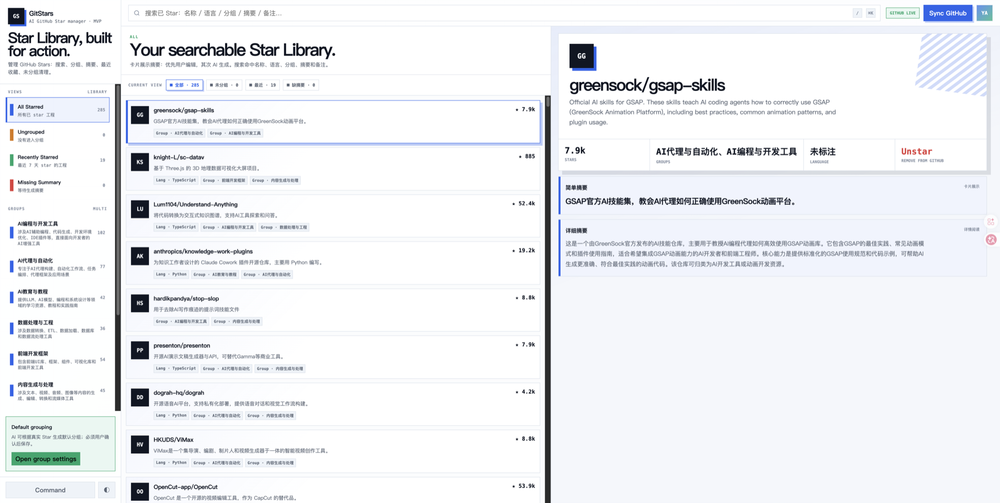
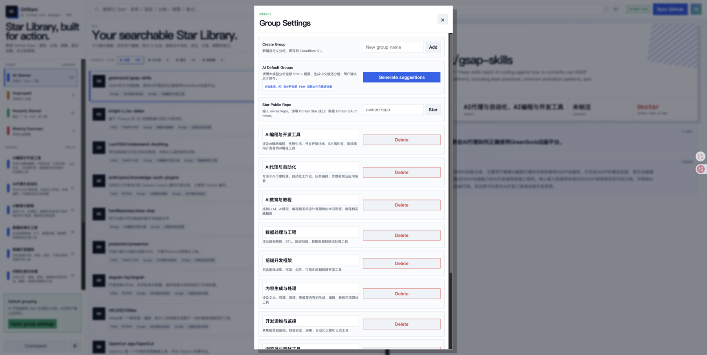
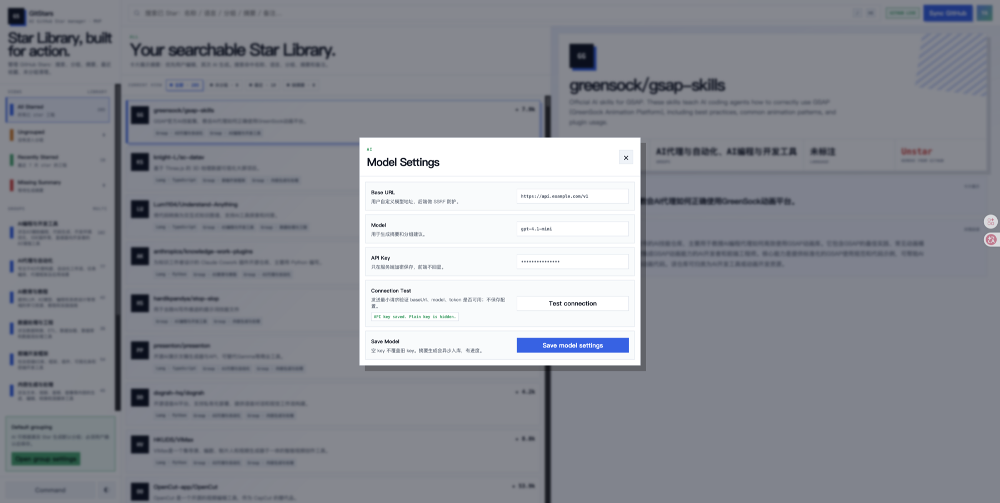
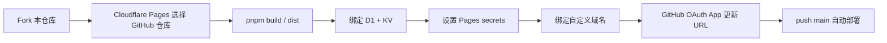

# GitStars Next

[English README](README.en.md)

GitStars Next 是一个 AI 辅助的 GitHub Star 管理工作台。它把用户真实的 GitHub Star 同步到 Cloudflare D1，用用户自己的大模型接口生成中文摘要，并支持把仓库整理到可长期维护的多分组体系。

当前部署目标是：

```text
Vue 3 前端 + Cloudflare Pages Functions + Cloudflare D1 + Cloudflare KV
```

---

## 1. 涉及功能

### 1.1 GitHub Star 同步

- GitHub OAuth 生产登录。
- 本地开发 token 登录。
- 拉取用户真实 public starred repositories。
- 增量同步：记录页码、cursor、最近同步状态。
- 修复同步：用于完整对账和补齐缺失 Star。
- 支持 GitHub Star / Unstar 操作。
- GitHub rate limit 暂停与继续。

### 1.2 Star 管理工作台

- 仓库列表卡片。
- 仓库详情面板。
- 全部 Star、未分组、最近 Star、已有摘要、缺摘要视图。
- 按仓库名、owner、语言、分组、摘要、备注搜索。
- 右键菜单和命令面板。
- 亮色 / 暗黑主题。

### 1.3 AI 中文摘要

- 为缺摘要仓库生成短摘要和详细摘要。
- 支持单仓库摘要生成。
- 支持批量补全缺失摘要。
- 用户手写摘要优先展示，覆盖 AI 摘要。
- 模型配置存服务端，API Key 加密保存，不回显明文。

### 1.4 AI 分组

- 基于全部 Star 和摘要生成中文候选分组。
- 用户选择候选分组后，AI 自动把仓库落组。
- 未分组视图支持一键智能分组。
- 如果没有合适分组，先询问是否创建新分组。
- 支持手动创建、重命名、删除分组。
- 仓库分组编辑使用草稿模式，点击完成才保存。

### 1.5 安全能力

- HttpOnly session cookie。
- 写接口 CSRF 校验。
- GitHub token 加密保存。
- 模型 API Key 加密保存。
- 模型 endpoint SSRF 防护，禁止 localhost / private IP / 内网地址。
- 模型请求超时和响应大小限制。


---

## 2. 功能截图

### 2.1 Star Library 总览



### 2.2 AI 摘要


### 2.3 AI 分组



### 2.4 模型配置



---

## 3. 架构

### 2.1 总览

```text
Browser
  |
  | HTTPS
  v
Cloudflare Pages static assets
  |
  | same-origin fetch /api/*
  v
Cloudflare Pages Functions
  |
  +--> D1 binding DB
  |      users / sessions / github_tokens
  |      repositories / user_repositories
  |      groups / repository_groups
  |      summaries / sync_jobs / summary_jobs
  |
  +--> KV binding CACHE
  |
  +--> GitHub API
  |      OAuth / user / starred repos / star / unstar
  |
  +--> User model API
         OpenAI-compatible or Anthropic-compatible endpoint
```

### 2.2 主要目录

```text
src/                         Vue 前端、Pinia store、UI、API client
functions/api/               Cloudflare Pages Functions API
functions/api/_shared/       D1、GitHub、AI、认证、CSRF、加密、HTTP 工具
migrations/                  D1 schema migrations
DEPLOYMENT.md                 AI agent Cloudflare 部署手册
scripts/                     smoke 和 API 验证脚本
wrangler.toml                Cloudflare Pages/D1/KV 配置
.dev.vars.example            本地开发环境变量模板
```

### 2.3 长任务模型

项目不依赖 Cloudflare Queues / Durable Objects。长任务由前端驱动 step job：

```text
GitHub 同步：
/api/sync/start
  -> repeated /api/sync/step

摘要生成：
/api/summaries/start
  -> repeated /api/summaries/step

AI 分组：
/api/groups/suggestions
  -> /api/groups/suggestions/accept
  -> /api/groups/auto-assign
```

好处：MVP 只需要 Pages Functions + D1，部署简单。代价：浏览器需要保持任务循环运行，极长任务不适合关页后台跑。

---

## 4. 数据存储

### 3.1 D1

核心表：

```text
users                 GitHub 用户
sessions              登录 session 和 CSRF token hash
github_tokens          加密后的 GitHub OAuth token
repositories           GitHub 仓库元数据
user_repositories      用户 Star 关系
groups                 用户分组
repository_groups      仓库和分组关系
summaries              用户摘要、AI 摘要、fallback 摘要
model_settings         用户模型配置和加密 API Key
sync_jobs              GitHub 同步任务
github_sync_state      GitHub 同步进度状态
summary_jobs           摘要任务
summary_job_items      摘要任务明细
```

### 3.2 KV

当前绑定名：

```text
CACHE
```

KV 主要作为缓存/扩展预留 binding。核心业务数据以 D1 为准。

---

## 5. 本地运行

### 4.1 安装依赖

```bash
pnpm install
```

### 4.2 配置本地环境变量

```bash
cp .dev.vars.example .dev.vars
```

`.dev.vars` 示例：

```text
GITHUB_CLIENT_ID=your_github_oauth_app_client_id
GITHUB_CLIENT_SECRET=your_github_oauth_app_client_secret
ENCRYPTION_SECRET=local-long-random-secret
APP_ORIGIN=http://127.0.0.1:8788

# 可选：本地 token 登录，不需要 OAuth App
DEV_GITHUB_TOKEN=your_github_token
```

### 4.3 启动 Cloudflare Pages 本地服务

不要只跑 `pnpm dev`。`pnpm dev` 只启动 Vite 前端，不会挂载 Pages Functions 和 D1 binding，页面会没有真实 API 数据。

正确本地启动：

```bash
pnpm build
pnpm wrangler d1 migrations apply gitstars --local
pnpm wrangler pages dev dist --ip 127.0.0.1 --port 8788
```

访问：

```text
http://127.0.0.1:8788
```

---

## 6. 本地鉴权和测试

### 5.1 本地 OAuth 登录

如果本地 `.dev.vars` 配了 GitHub OAuth：

```text
GITHUB_CLIENT_ID
GITHUB_CLIENT_SECRET
ENCRYPTION_SECRET
APP_ORIGIN=http://127.0.0.1:8788
```

浏览器打开：

```text
http://127.0.0.1:8788/api/auth/github/start
```

GitHub OAuth App 本地配置应包含：

```text
Homepage URL:
http://127.0.0.1:8788

Authorization callback URL:
http://127.0.0.1:8788/api/auth/github/callback
```

### 5.2 本地 token 登录

如果不想创建本地 OAuth App，可用 GitHub token：

```text
DEV_GITHUB_TOKEN=...
ENCRYPTION_SECRET=local-long-random-secret
APP_ORIGIN=http://127.0.0.1:8788
```

登录入口：

```text
http://127.0.0.1:8788/api/dev/login
```

限制：

```text
/api/dev/login 只允许 localhost / 127.0.0.1 / ::1
生产环境不能用 DEV_GITHUB_TOKEN 登录
```

### 5.3 API smoke

先启动 Pages 本地服务，再运行：

```bash
pnpm verify:api
```

### 5.4 UI smoke

```bash
pnpm smoke:ui
```

### 5.5 常规验证

```bash
pnpm typecheck
pnpm test
pnpm build
```

---

## 7. Cloudflare 部署

只推荐一种方式：**Fork 本仓库，然后在 Cloudflare Pages 关联自己的 GitHub 仓库自动部署**。

不要把生产部署做成 `wrangler pages deploy dist` 的 Direct Upload 项目。Direct Upload 不能原地改成 GitHub 自动部署项目，后续迁移麻烦。

部署手册：

```text
DEPLOYMENT.md
```

给 AI agent 的一句话：

```text
请读取 DEPLOYMENT.md，按 GitHub 关联自动部署方式，把我 fork 后的仓库部署到 Cloudflare Pages。
```

推荐流程：



用户通常只需要准备：

```text
GitHub 账号
Cloudflare 账号
GitHub OAuth App Client ID
GitHub OAuth App Client Secret
```

Cloudflare Pages 构建配置：

```text
Framework preset: None
Production branch: main
Build command: pnpm build
Build output directory: dist
Root directory: 留空
```

Pages secrets：

```text
GITHUB_CLIENT_ID
GITHUB_CLIENT_SECRET
ENCRYPTION_SECRET
APP_ORIGIN
```

安全建议：不要把 secret 发在聊天里。AI 到 secrets 步骤时给出：

```bash
pnpm wrangler pages secret put GITHUB_CLIENT_ID --project-name <pages-project>
pnpm wrangler pages secret put GITHUB_CLIENT_SECRET --project-name <pages-project>
pnpm wrangler pages secret put ENCRYPTION_SECRET --project-name <pages-project>
pnpm wrangler pages secret put APP_ORIGIN --project-name <pages-project>
```

你在本机终端交互输入值。

生产域名规则：

```text
推荐：https://gitstars.<your-domain>
默认：https://<pages-project>.pages.dev
不支持：https://<your-domain>/gitstars-next
```

GitHub OAuth App URL：

```text
Homepage URL: <APP_ORIGIN>
Authorization callback URL: <APP_ORIGIN>/api/auth/github/callback
```

细节以 `DEPLOYMENT.md` 为准。

---

## 8. 生产验证

### 7.1 静态页

```bash
curl -I <PRODUCTION_ORIGIN>
```

预期：

```text
HTTP 200 或 304
content-type: text/html
```

### 7.2 API 未登录状态

```bash
curl -sS <PRODUCTION_ORIGIN>/api/me
```

预期：

```json
{
  "ok": true,
  "data": {
    "user": null,
    "settings": {
      "model_enabled": false
    },
    "csrf_token": null
  }
}
```

### 7.3 OAuth 登录

浏览器打开：

```text
<PRODUCTION_ORIGIN>
```

点击：

```text
Connect GitHub
```

成功后 D1 应出现：

```text
users > 0
sessions > 0
github_tokens > 0
```

### 7.4 GitHub Star 同步

登录后点击：

```text
Sync GitHub
```

成功后 D1 应出现：

```text
repositories > 0
user_repositories > 0
```

---

## 9. 本地数据和远端数据

本地 D1 数据不会自动同步到远端 D1。

常见选择：

```text
A. 生产页面点击 Sync GitHub，远端重新从 GitHub 拉取 Star。
B. 如果要保留本地摘要/分组，按部署手册导入本地业务数据到远端。
```

导入本地数据时，默认不要导入：

```text
sessions
github_tokens
users
```

避免覆盖生产登录态和 token。

通常只迁移：

```text
repositories
user_repositories
groups
repository_groups
summaries
model_settings（可选，注意 ENCRYPTION_SECRET）
github_sync_state（可选）
```

---

## 10. 模型配置

页面路径：

```text
User settings -> Model Settings
```

需要填写：

```text
Base URL
Model name
API Key
```

支持：

```text
OpenAI-compatible endpoint
Anthropic-compatible endpoint
```

安全限制：

```text
- API Key 只保存在服务端 D1，且加密存储。
- 前端不回显明文 API Key。
- Base URL 必须是公网 HTTPS endpoint。
- localhost、private IP、内网地址会被 SSRF guard 阻止。
```

---

## 11. 常用命令

```bash
# 本地完整运行
pnpm build
pnpm wrangler d1 migrations apply gitstars --local
pnpm wrangler pages dev dist --ip 127.0.0.1 --port 8788

# 质量验证
pnpm typecheck
pnpm test
pnpm build
pnpm smoke:ui

# API smoke，需先启动本地 Pages
pnpm verify:api

# 部署
# 让 AI 读取 DEPLOYMENT.md 并按手册执行
```

---

## 12. 当前范围

MVP 已覆盖：

```text
GitHub OAuth 登录
GitHub Star 同步
Star / Unstar
仓库搜索和筛选
AI 摘要
用户手写摘要
AI 分组建议
AI 自动落组
手动分组
模型配置
Cloudflare D1 持久化
Cloudflare Pages Functions API
```

暂不包含：

```text
Trending
Preference
README scan
Watchlist
后台队列
多用户协作权限模型
```
